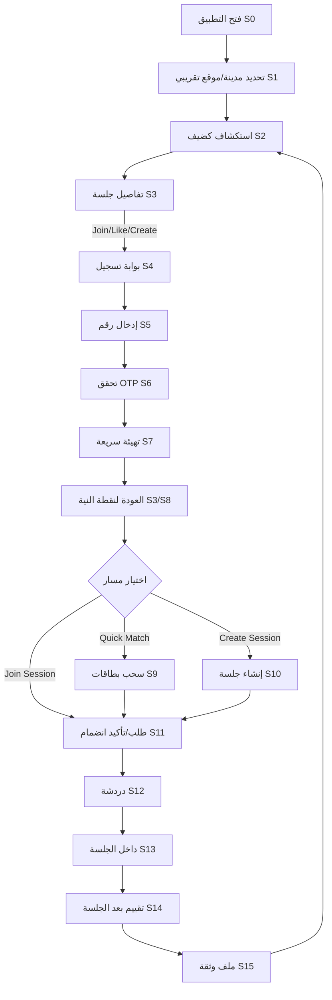

# حزمة منتج ومستثمر لتطبيق «مَعَك» MA3AK لمطابقة النوايا الاجتماعية في سوريا

## الملخص التنفيذي

«مَعَك» هو تطبيق **مطابقة نوايا** (Social Intent‑Matching) يربط الأشخاص وفق **الهدف + التوقيت + القرب المكاني/الافتراضي + مستوى الخصوصية**. بدلاً من أن يكون “تطبيق طلعات”، يصبح نظاماً عاماً لسيناريوهات الحياة اليومية: **دراسة، عمل/جلسات إنتاجية، مشاريع، تعارف اجتماعي/لقاء 1:1 بشكل غير مباشر، رياضة/مشي، شبكات مهنية، تطوّع**. جوهر المنتج هو كائن واحد اسمه **جلسة Session** (وقت‑محدّد، نية واضحة، سعة محدودة، آمن وقابل للتقييم)، مع **دوائر Circles** (مجتمعات صغيرة مستمرة) تقلل مشكلة “التطبيق الفاضي” وتزيد الأمان والالتزام.

الملاءمة للسياق السوري عالية لأن السوق **شاب** و**محمول‑أولاً** مع قيود واقعية في الإنترنت والدفعات والخصوصية. في أحدث تقرير متاح لدى DataReportal (منشور نهاية 2025 ليمثل 2026)، يوجد في سوريا **20.1 مليون اتصال خلوي** (77.7% من السكان)، و**9.25 مليون مستخدم إنترنت** (35.8% انتشار). كما أن **العمر الوسيط 23.3** سنة، والشريحة 18–34 تمثل **33.1%** من السكان؛ ما يدعم تبنّي منتج يعتمد على التنسيق الاجتماعي اليومي. citeturn1view0

الهدف في Startup Syria: تقديم MVP خلال يوم واحد يثبت ثلاث نقاط للمحكّمين والمستثمر:  
1) **قيمة يومية واضحة** (تحويل نية فردية إلى نشاط جماعي سريع وآمن)،  
2) **نظام ثقة وسلامة** واقعي (خصوصاً مع حساسية الموقع والتعارف)،  
3) **نموذج عمل محترف** (اشتراكات + تعزيزات + شراكات B2B + دفعات محلية) مبني على أنماط إيرادات مثبتة في منصات المطابقة/الشبكات. citeturn14search0turn14search2

---

## السوق والسياق في سوريا

### الإنترنت والهواتف والقيود التقنية

أحدث أرقام DataReportal لسوريا (Digital 2026 المنشور نهاية 2025) تشير إلى:  
- 20.1 مليون اتصال خلوي (77.7% من السكان). citeturn1view0  
- 9.25 مليون مستخدم إنترنت (35.8% انتشار). citeturn1view0  
- سرعات اتصال وسيطة: **المحمول 24.69 Mbps** و**الثابت 3.35 Mbps** في نهاية 2025. هذا يعني أن “تطبيق دردشة + بطاقات + خرائط خفيفة” عملي، بينما الفيديو/الميزات الثقيلة يجب ألا تكون افتراضية في MVP. citeturn1view0  

**استنتاج تصميمي مباشر:**  
- اعتمد على واجهات “بطاقات/قائمة” وخرائط اختيارية (ليست افتراضية دائماً).  
- خفّف الصور والفيديو (اختياري وبتحجيم صارم) لأن الثابت منخفض جداً. citeturn1view0  

### الشباب والديموغرافيا

DataReportal يورد أن:  
- العمر الوسيط 23.3. citeturn1view0  
- توزيع الأعمار: 18–24 = 16.0%، 25–34 = 17.1% (المجموع 33.1%). citeturn1view0  

UNICEF تؤكد أيضاً أن **الشباب (10–24) يشكلون قرابة ثلث السكان** في سوريا، ما يعزز قابلية انتشار منتج اجتماعي منضبط بالأمان. citeturn0search1  

### القيود المالية والدفعات

السياق السوري حساس من ناحية الدفع: الاعتماد على النقد شائع، وبُنى الدفع الرقمية متجزئة. لكن توجد بوادر عملية يمكن البناء عليها:  
- دراسة أكاديمية عن سوريا تشير إلى أن شركتي الاتصالات قدّمتا خدمات دفع إلكتروني **Syriatel Cash** و **MTN Pay** في **مايو 2021**، حيث يستخدم العملاء الرصيد/القنوات المتاحة لدفع فواتير وشراء خدمات وشحن رصيد. citeturn5search2  
- يوجد أيضاً قنوات مصرفية محلية تقدم دفع فواتير وخدمات (مثال: تطبيق مصرفي محلي يذكر دفع فواتير Syriatel/MTN وخدمات حكومية). citeturn5search6  

**استنتاج للمستثمر:** نموذج الإيرادات يجب أن يعمل حتى عند ضعف بطاقات الائتمان، عبر:  
- قسائم (Vouchers) عبر شركاء محليين،  
- محافظ/بوابات محلية حيثما أمكن،  
- دفع داخل التطبيق إن توفر عبر المتاجر + بدائل محلية لاحقاً. citeturn5search2turn5search6  

### مخاطر الخصوصية (خصوصاً الموقع)

أي تطبيق يعتمد على الموقع يحمل مخاطر خصوصية فعلية:  
- بحث كلاسيكي عن تقنيات مشاركة الموقع يوضح أن المستخدمين يدركون فوائدها لكن لديهم مخاوف من سيناريوهات ضرر مثل التتبع/الملاحقة، وأن جودة “ضوابط الخصوصية” داخل التطبيقات عامل حاسم. citeturn3search0  
- مراجع عن شبكات اجتماعية قائمة على الموقع تؤكد وجود “تحديات خصوصية” وطرق للتخفيف (مثل إخفاء الدقة، والتغليف المكاني Spatial Cloaking). citeturn3search1turn3search13  

**نتيجة:** “مَعَك” يجب أن يكون **Privacy‑First**: الموقع تقريبي افتراضياً، ودقته ترتفع فقط عند تحقق شروط سلامة (قبول متبادل/دائرة موثوقة/كود لقاء).

---

## التحليل النفسي للتبنّي والتصميم

### لماذا سيستخدمه الناس يومياً؟ (Fogg + SDT + التزام)

**نموذج فوج للسلوك (B=MAP)** يقول إن السلوك يحدث عندما تجتمع: الدافعية + القدرة (سهولة التنفيذ) + محفّز في اللحظة. citeturn0search2turn0search6  
ترجمة ذلك لمنتج:  
- الدافعية: “أنا محتاج أدرس/أشتغل/أتعرف/أطلع”  
- القدرة: زر واحد “أنا فاضي الآن” + جلسات جاهزة  
- المحفّز: إشعار/اقتراح عند أوقات الذروة أو عند فتح التطبيق  

**نظرية تحديد الذات SDT** تشير إلى أن دعم **الاستقلالية + الكفاءة + الارتباط** يولد دافعية عالية الجودة واستمرارية. citeturn2search0turn2search1  
ترجمتها في «مَعَك»:  
- الاستقلالية: المستخدم يختار “النية” لا يُدفع قسراً لمسار واحد.  
- الكفاءة: قياس تقدّم وموثوقية (Reliability) بعد الجلسات.  
- الارتباط: تفاعل حقيقي مع أشخاص لهدف ملموس.  

### دور المتابعة والمحاسبة (Accountability) في الدراسة والعمل

مراجعة تحليلية (Meta‑analysis) حول “مراقبة تقدّم الهدف” تُظهر أنها استراتيجية فعالة لتعزيز تحقيق الأهداف وأن زيادة تكرار المتابعة غالباً يدعم التغيير السلوكي. citeturn0search3  
هذا يدعم ميزة “جلسات التركيز” (Study/Work Sprints):  
- هدف مكتوب قبل البدء  
- مؤقت (Timer)  
- سؤال بعد الجلسة: هل تحقق الهدف؟  
- تقييم متبادل للسلوك (الالتزام/الاحترام/التركيز)  

### العادة والعودة (Habit Formation)

أبحاث تكوين العادات في الحياة الواقعية تشير إلى أن تكوّن العادة يتطلب تكراراً واستمرارية؛ ما يهمنا هنا ليس الرقم نفسه بل تصميم “حلقة” يومية بسيطة: فتح → اختيار نية → انضمام/إنشاء → جلسة → تقييم → اقتراح لاحق. citeturn2search2turn2search13  

### المتعة بدون طفولة: Gamification “رصينة”

أبحاث في تصميم التحفيز (Gamification) توضح أن عناصر مثل الشارات/لوحات الصدارة/مخططات الأداء قد تزيد الإحساس بالكفاءة والمعنى عندما تكون مرتبطة بأداء حقيقي، وأن “الألعاب” ليست فعالة بحد ذاتها بل العناصر المناسبة تؤثر نفسياً بشكل مختلف. citeturn13search5turn13search2  
لذلك:  
- لا “ميداليات كرتونية”.  
- استخدم مؤشرات احترافية: **موثوقية، انضباط وقت، تعاون، احترام، تركيز**.  
- اجعل أي ترتيب “ضمن الدائرة” وليس عاماً دائماً لتجنب سلوكيات سامة.

---

## مفهوم المنتج الكامل

### الكائن الأساسي: Session (جلسة)

الجلسة هي وحدة المنتج. كل شيء يدور حولها. خصائصها المقترحة (MVP وما بعده):  
- **IntentType**: دراسة، عمل، مشروع، تواصل اجتماعي، 1:1 لقاء، رياضة/مشي، مراجعة CV، تطوع…  
- **Time**: الآن / مجدولة + مدة.  
- **Mode**: حضوري (تقريب مكان) / أونلاين.  
- **Capacity**: 1:1 أو مجموعة صغيرة (2–8).  
- **Privacy**: عامة / طلب انضمام / بدعوة / داخل دائرة فقط.  
- **SafetyLevel**: قواعد تختلف حسب 1:1 أو مجموعة.  
- **Tags**: “هادئ، تركيز، سوشال، شغل عميق، مبتدئ/متقدم…”  
- **Location**: تقريبي افتراضياً (حي/منطقة)، مع خيار “مكان دقيق” بعد قبول/كود لقاء.

### Circles (دوائر)

الدوائر هي مجتمعات صغيرة مستمرة: جامعة/حي/مجال عمل/اهتمام. فائدتها:  
- بناء كثافة بسرعة (حل مشكلة التطبيق الفارغ).  
- رفع الأمان (أعضاء موثوقون/مشرفون).  
- تمكين استخدام للكبار أيضاً (دوائر مهنية).  

### واجهات المنتج (Surfaces)

- **Explore**: قائمة جلسات قريبة/شائعة + دوائر مقترحة.  
- **Swipe / Quick Match**: بطاقات جلسات (وليس “وجوه”) — “أعجبني/تخطّي” لتقليل الحمل المعرفي.  
- **Create**: إنشاء جلسة خلال 20 ثانية.  
- **Chat**: الدردشة لا تُفتح إلا بعد قبول/مطابقة متبادلة (خصوصاً 1:1).  
- **Profile**: التفضيلات + الأهداف المتكررة + مؤشرات الثقة + وضع “Pro”.  
- **Safety Center**: حظر/إبلاغ/قواعد الدوائر/تأكيدات اللقاء.

image_group{"layout":"carousel","aspect_ratio":"16:9","query":["mobile app swipe card interface minimal clean sessions","location based social app explore list lightweight UI","group chat UI minimal low bandwidth app design","map pins neighborhood heatmap UI mobile app"],"num_per_query":1}

---

## تدفق المستخدم الكامل من البداية للنهاية

المبدأ الحاكم: **أظهر القيمة قبل التسجيل**. التسجيل المبكر يقلل التحويل في بيئات منخفضة الثقة. (اتساقاً مع Fogg: خفّض “القدرة/الجهد” إلى الحد الأدنى قبل طلب الالتزام). citeturn0search6  

### تعريف الشاشات (Screen IDs) لتغذية فرق/وكلاء AI

- S0 Splash  
- S1 City Picker (اختياري)  
- S2 Explore (Guest)  
- S3 Session Details (Guest)  
- S4 Auth Gate Modal  
- S5 OTP Phone Entry  
- S6 OTP Verify  
- S7 Onboarding (3 أسئلة)  
- S8 Explore (Logged‑in)  
- S9 Quick Match (Swipe Deck)  
- S10 Create Session  
- S11 Join Request / Join Confirm  
- S12 Chat (Group / 1:1)  
- S13 In‑Session (Timer + Goal + Checklist)  
- S14 Post‑Session Rating  
- S15 Profile & Trust  
- S16 Report/Block Flow  
- S17 Circle Page + Circle Chat (اختياري MVP)

### قواعد “متى نطلب Login؟” (Triggers)

**بدون تسجيل (Guest Mode) مسموح:**  
- تصفح Explore ودوائر وجلسات (مع بيانات محدودة).  
- رؤية “عدد المشاركين” ووقت البداية والتصنيف.  
- استخدام Swipe بشكل محدود (مثلاً 5 بطاقات/يوم) لكن “Like” الحقيقي يحتاج تسجيل.

**يُطلب التسجيل عند أول فعل عالي النية أو عالي المخاطر:**  
- الضغط على “انضم” Join  
- الضغط على “أعجبني” Like (Swipe Right)  
- إنشاء جلسة  
- فتح الدردشة  
- الإبلاغ/الحظر (لربط البلاغ بحساب)

### التدفق خطوة بخطوة (Developer‑Ready)

**المرحلة الأولى: دخول سريع واكتشاف قيمة**  
1) S0 → S1 (اختياري: تحديد المدينة/السماح بموقع تقريبي)  
2) S2 Explore (Guest)  
   - عناصر: Tabs (Sessions / Circles) + فلتر (IntentType) + زر “أنا فاضي الآن” (مقفل جزئياً)  
3) المستخدم يفتح S3 تفاصيل جلسة (Guest)  
4) يضغط Join → يظهر S4 Auth Gate  
   - رسالة قصيرة: “لتأكيد الانضمام وحماية المجتمع، سجّل خلال 10 ثوانٍ.”

**المرحلة الثانية: تسجيل دخول OTP (أو Mock في الهاكاثون)**  
5) S5 إدخال رقم الهاتف  
6) S6 تحقق OTP  
   - MVP: يمكن استخدام Mock OTP أثناء العرض (مع توضيح “قابل للاستبدال بمزوّد SMS محلي”)  
7) نجاح → S7 Onboarding (3 أسئلة فقط)  
   - Q1: ما أهدافك الأكثر تكراراً؟ (اختر 3)  
   - Q2: تفضيل الخصوصية (عامة/طلب انضمام افتراضياً)  
   - Q3: أوقاتك المعتادة (صباح/مساء/كلاهما)

**المرحلة الثالثة: العودة لنقطة النية (لا تعيد المستخدم للصفحة الرئيسية بلا سبب)**  
8) بعد Onboarding ارجع تلقائياً إلى S3 الجلسة التي حاول الانضمام لها  
9) S11 Join Confirm  
   - إن كانت الجلسة عامة: “تم الانضمام” وفتح S12 Chat  
   - إن كانت طلب انضمام: إرسال Request للمنشئ + حالة Pending

**المرحلة الرابعة: رحلة “Quick Match”**  
10) من S8 Explore (Logged‑in) → المستخدم يضغط “أنا فاضي الآن”  
11) S9 Swipe Deck يعرض بطاقة جلسة واحدة في كل مرة:  
   - Intent + وقت + سعة + “حي” تقريبي + مستوى أمان + “داخل دائرة/عام”  
12) Swipe Right →  
   - إذا جلسة عامة: Join مباشرة + Chat  
   - إذا 1:1: لا Chat إلا بعد **مطابقة متبادلة** (Mutual)  
   - إذا طلب انضمام: Pending + إشعار للمنشئ  
13) Swipe Left → Next Card

**المرحلة الخامسة: إنشاء جلسة (Create)**  
14) من S8 → S10 Create Session  
   - حقول MVP: IntentType، الآن/مجدولة، مدة، سعة، خصوصية، Mode حضوري/أونلاين، حي/منطقة (تقريبي)  
   - اختياري: نص “الهدف” (مهم للدراسة/العمل)  
15) نشر الجلسة → تظهر في Explore + إرسالها تلقائياً للدائرة المحددة إن وُجدت

**المرحلة السادسة: أثناء الجلسة (In‑Session UX)**  
16) عندما يحين وقت البداية أو عند اكتمال الحد الأدنى من المشاركين → S13 In‑Session  
   - Goal pinned  
   - Timer (25/50/90)  
   - “قواعد سريعة”: احترام/تركيز/عدم مشاركة موقع دقيق قبل اتفاق  
   - زر “إبلاغ سريع” يظهر دائماً (S16)  

**المرحلة السابعة: بعد الجلسة**  
17) انتهاء المؤقت أو إنهاء يدوي → S14 Post‑Session Rating  
   - 3 أسئلة سريعة: “التزم بالوقت؟” “كان محترماً؟” “حقق الهدف/ساهم؟”  
   - اختيار “إخفاء اسمي في التقييم” (لحماية اجتماعية)  
18) تحديث Trust Score في S15 Profile & Trust  
19) اقتراح جلسة لاحقة “مماثلة” + زر “إعادة مع نفس المجموعة”

### مخطط Mermaid لتدفق المستخدم

---

## قواعد UX للإنترنت الضعيف والخصوصية

### قواعد الأداء (Low Bandwidth)

- افتراضياً: واجهة قائمة/بطاقات؛ الخريطة **اختيارية** وليست الشاشة الأولى.  
- تحميل كسول Lazy Loading + Pagination واضح.  
- ضغط الصور لتكون مصغرة فقط (Thumbnails) وبدون فيديو افتراضي.  
- Cache محلي لجلسات آخر 24 ساعة (قراءة فقط) لتقليل الاستهلاك.  
- تقليل عدد النداءات الشبكية: اجمع Endpoints (جلسات + دوائر + اقتراحات) في استجابة واحدة عند فتح التطبيق.

مرجعية القرار: سرعات الإنترنت الثابت منخفضة جداً مقارنة بالمحمول، لذلك “الشبكة ليست مضمونة”. citeturn1view0  

### الخصوصية الافتراضية (Privacy by Default)

- الموقع يظهر “حي/منطقة” فقط، مع تقريبات (Geo‑hash) لا تُظهر نقطة دقيقة.  
- مشاركة الموقع الدقيق تتطلب:  
  - داخل دائرة موثوقة، أو  
  - قبول متبادل + كود لقاء، أو  
  - تأكيد “أنا وصلت” بدون إحداثيات دقيقة  
- في 1:1:  
  - لا رسائل قبل Mutual Match  
  - لا “متصل الآن” افتراضياً (اختياري)  
- حفظ البيانات: احتفظ بالحد الأدنى (Minimal Retention) لبيانات الموقع التاريخية؛ ميّز ذلك في السياسة.

هذه الممارسات منسجمة مع الأدبيات التي تحذر من مخاطر مشاركة الموقع وتوصي بضوابط خصوصية فعّالة وتقنيات إخفاء/تغليف مكاني. citeturn3search0turn3search13  

---

## النمو وخطة الذهاب للسوق ونموذج العمل

### نمو “مدينة‑بمدينة” وبناء الكثافة

المنتجات الشبكية تفشل غالباً بسبب “البرودة” في البداية (لا مستخدمين → لا قيمة). الإطار النظري الشائع للشبكات يوصي ببناء شبكة صغيرة ناجحة ثم التوسع تدريجياً (غالباً مدينة‑بمدينة أو مجتمع‑بمجتمع). citeturn4search1  

**خطة إطلاق مناسبة لسوريا (عملية وسريعة):**  
- ابدأ بـ “نقطة كثافة” واحدة: جامعة/كلية/مساحة عمل مشتركة/مركز تدريب.  
- فعّل دوائر جاهزة: “طلاب سنة أولى”، “Freelancers”، “جلسات دراسة”، “مؤسسي مشاريع”.  
- استهدف “قادة مجتمع” (Ambassadors) لإنشاء جلسات حقيقية يومياً.

### “زرع نشاط” بشكل أخلاقي (Ethical Seeding)

بدلاً من تضليل المستخدمين بأشخاص وهميين:  
- أنشئ جلسات Seed بواسطة الفريق/سفراء معلنين بصفتهم: “جلسة مستضافة من المجتمع”.  
- ضع Badge واضح: “Hosted / Verified Seed”.  
- استخدم بيانات تجريبية في العرض فقط، مع تصريح شفهي: “هذه بيانات عرض MVP”.  
الهدف: حل مشكلة “الفارغ” دون خداع.

### نموذج العمل (Business Model) بشكل احترافي

**مرجعية المستثمر:** منصات المطابقة/الاتصال الكبرى تصرّح أن الإيراد المباشر يأتي أساساً من **اشتراكات متكررة** + بدرجة أقل من **ميزات مستهلكة (Boosts/A‑la‑carte)**. citeturn14search0turn14search2  

#### مسارات الإيراد

1) **B2C اشتراكات**  
- Plus: فلاتر إضافية + عدد أكبر من الانضمامات/اليوم + إخفاء/ظهور  
- Pro: موجه للمهنيين: دوائر مهنية، أدوات فريق صغيرة، أولوية في جلسات المشاريع

2) **Boosts/Promotions (A‑la‑carte)**  
- Boost جلسة لمدة 30–120 دقيقة لجذب عدد أكبر داخل نفس المدينة/النية  
- Highlight Profile داخل دائرة محددة (لا على مستوى البلد)

3) **B2B شراكات أماكن (Venues / Coworking)**  
- “صفحة مكان” + إمكانية استضافة جلسات + تحليلات طلب (على مستوى إجمالي)  
- اشتراك شهري/ربع سنوي

4) **Insights (بيانات مجمّعة وآمنة)**  
- تقارير نشاط مجمّعة للجهات الشريكة (أوقات الذروة حسب النية)  
- شرط حاسم: بيانات مجهولة ومجمعة، لا تتبع فردي (تماشياً مع مخاطر الخصوصية). citeturn3search1turn3search0  

#### خيارات الدفع العملية في سوريا

- الدفع داخل التطبيق (إن أمكن عبر المتاجر)  
- تكامل تدريجي مع قنوات محلية:  
  - خدمات دفع الاتصالات (Syriatel Cash/MTN Pay) كمسار واقعي موثق أكاديمياً. citeturn5search2  
  - قسائم عبر شركاء (مقاهي/مساحات عمل)  
  - تحويل محلي/مصرفي حيث متاح (وجود خدمات دفع فواتير محلية موثق). citeturn5search6  

### افتراضات اقتصاديات الوحدة (Unit Economics) — “افتراضات تخطيطية” قابلة للتعديل

هذه ليست حقائق؛ بل نموذج بسيط لإقناع المستثمر بأن الفريق يفهم المعادلة:

- نفرض مدينة إطلاق فيها 20,000 مستخدم مسجّل خلال 6 أشهر  
- نسبة نشطين شهرياً MAU: 35% (7,000)  
- تحويل إلى اشتراك: 1.5% من MAU (105 مشتركين)  
- ARPPU شهري (متوسط الإيراد لكل دافع) = 2$ (اشتراك + تعزيزات)  
- إيراد B2C شهري = 210$  
- شراكات B2B: 10 أماكن × 15$ شهري = 150$  
- إجمالي شهري ≈ 360$ كبداية  
- التكاليف: خادم/قاعدة بيانات + إشعارات + (SMS OTP لاحقاً)  
- هدف المرحلة الأولى: إثبات “الاحتفاظ والموثوقية” قبل تعظيم الإيراد

نقطة المستثمر: **المنتج شبكة + ثقة**؛ الإيراد الحقيقي يأتي بعد كثافة وتكرار، وهذا منطقي في منتجات الشبكات. citeturn4search1turn14search0  

### جداول مطلوبة

**جدول الإيرادات والتسعير (افتراضات قابلة للتعديل)**

| تدفق الإيراد | من يدفع؟ | ماذا يحصل؟ | تسعير مقترح (نسبي/تقريبي) | ملاحظات دفع محلية |
|---|---|---|---|---|
| Plus | أفراد | فلاتر/انضمامات/خصوصية | منخفض جداً (مناسب للطلاب) | قسائم + متاجر + مزوّد محلي |
| Pro | أفراد مهنيون | دوائر مهنية + أدوات تعاون | أعلى من Plus لكن ما يزال منخفضاً | قسائم عبر شركاء B2B |
| Boost Session | أفراد/منشئو جلسات | ظهور أعلى لمدة قصيرة | شراء متكرر صغير | مناسب كنقد/قسائم |
| Venue Subscription | أماكن | صفحة + استضافة + ظهور + Insights مجمعة | 10–50$ شهرياً حسب حجم المكان | فواتير/تحويل محلي |
| Insights | أماكن/جهات | تقارير مجمعة | حسب العقد | التزام صارم بالخصوصية |

(مرجعية هيكل الإيراد: الاشتراكات + الميزات المستهلكة مذكورة بوضوح في إفصاحات منصات كبرى). citeturn14search0turn14search2  

---

## الثقة والسلامة Trust & Safety

في سوريا، السلامة ليست “ميزة إضافية” بل شرط دخول.

### طبقات التحقق (Verification Tiers)

- **Tier 0: Guest** (لا تفاعل)  
- **Tier 1: Phone Verified** عبر OTP (الحد الأدنى للانضمام/الدردشة)  
- **Tier 2: Trusted** (اختياري لاحقاً): توثيق أقوى/دوائر مهنية/1:1 مقيّد  
- **Tier 3: Community Host** (سفير/مكان) مع شارة واضحة

### بوابات الأمان (Gating Rules)

- 1:1: لا دردشة قبل “مطابقة متبادلة” + حساب موثّق هاتفياً  
- مشاركة موقع دقيق: بعد قبول + (كود لقاء) أو داخل دائرة  
- أزرار Block/Report في كل شاشة تواصل

التوجيه العام “Safety by Design” يوصي بجعل السلامة وقائية ومضمنة في التصميم، لا رد فعل متأخر. citeturn3search3  

### الإبلاغ والاستجابة

أبحاث خبرة المستخدمين في الإبلاغ داخل منصات تعارف تشير إلى أن جودة تجربة الإبلاغ تؤثر على الثقة وعلى تباين الرضا بين الفئات. citeturn3search2turn3search14  
لذلك في MVP يجب أن تظهر في العرض:  
- مسار إبلاغ واضح من خطوتين  
- رسالة “ماذا يحدث بعد البلاغ؟”  
- زمن استجابة مستهدف (حتى لو يدوي في البداية)

### نظام السمعة (Reputation)

أدبيات أنظمة السمعة تشرح دورها في تسهيل الثقة على المنصات، لكنها تحذر من التحيز في التقييمات. citeturn2search3turn2search11  
تصميم مقترح يقلل التحيز:  
- تقييمات قصيرة سلوكية (وقت/احترام/التزام) بدل نجوم عامة  
- إخفاء هوية المقيّم افتراضياً داخل المجموعة  
- منع التقييم إلا بعد مشاركة فعلية في جلسة

---

## خطة بناء MVP في يوم واحد

مرجعية المنافسات السريعة: نمط Startup Weekend يركز على **النمذجة، بناء نموذج أولي، نموذج عمل، والتحقق** في زمن قصير (54 ساعة في نموذج Techstars)، وهو قريب من روح “بناء MVP سريع” في المسابقات. citeturn4search0turn4search2  

### اختيار الـ Tech Stack السريع (اقتراح عملي)

**Front‑end (سريع جداً):**  
- React Native (Expo) أو Flutter  
**Back‑end (أسرع MVP):**  
- Supabase (Auth + Postgres + Realtime) أو Firebase  
**Maps (اختياري MVP):**  
- خريطة خفيفة أو قائمة مناطق فقط (لتقليل التعقيد)  
**OTP:**  
- في العرض: Mock OTP  
- في المنتج: مزوّد SMS محلي أو بوابة اتصالات (قرار لاحق)

### ما الذي “نُنفّذه” وما الذي “نموّه” في يوم واحد؟

**جدول MVP مقابل المستقبل**

| المكوّن | MVP في يوم واحد | بعد المسابقة |
|---|---|---|
| Explore | قائمة جلسات + فلتر نية | توصيات ذكية + خريطة/Heatmap |
| Quick Match | Swipe على الجلسات | نموذج توصية + تعلّم تفضيلات |
| Create Session | نموذج بسيط 6 حقول | قوالب، تكرار أسبوعي، مكان دقيق بكود |
| Chat | غرفة مجموعة أساسية | وسائط، مكالمات، أدوات عمل |
| Trust Score | 3 أسئلة بعد الجلسة | أتمتة كشف إساءة + إشارات متقدمة |
| Circles | صفحة دائرة + قائمة جلسات | إدارة مشرفين، قواعد، عضوية مدفوعة |
| Payments | UI Mock فقط | قسائم + تكامل محلي (Syriatel/… ) citeturn5search2 |
| Safety | Block/Report + موقع تقريبي | تحقق أقوى + مراجعة بشرية/آلية |

### جدول زمني ليوم واحد (فريق 2 + AI)

**جدول خط زمني مع الأدوار**

| الزمن | الشخص 1 (منتج/بيتش) | الشخص 2 (بناء/تكامل) | AI Agents |
|---|---|---|---|
| ساعة 1–2 | صياغة القصة + الشرائح + تحديد MVP | تهيئة المشروع + قاعدة البيانات | توليد نصوص/UX/مراجعة |
| ساعة 3–5 | كتابة تدفق المستخدم + نص الديمو | بناء شاشات S0–S7 (Auth+Onboarding) | توليد مكوّنات UI |
| ساعة 6–8 | التحقق من المنطق + إعداد أمثلة جلسات | بناء Explore/QuickMatch/Create | توليد بيانات Seed |
| ساعة 9–11 | إعداد نموذج العمل + الأرقام | Chat + Join flow + Rating | اختبار حالات حافة |
| ساعة 12–14 | صقل Pitch + تدريب | تحسين الأداء/الخطوط/التخزين | تحسين نصوص الواجهات |
| ساعة 15–16 | تصوير Demo + تجهيز عرض | إصلاح أخطاء نهائية | تحضير FAQ للجنة |

### Deliverables للمسابقة (واضحة للمحكّم)

- Demo حي: إنشاء جلسة + Quick Match + Join + Chat + Timer + Rating  
- 6–8 شرائح Pitch (Problem → Solution → Market → Safety → Business → GTM → Metrics)  
- صفحة واحدة “Trust & Safety”  
- أرقام TAM تقريبية + مؤشرات نجاح أولية

---

## مقاييس النجاح التي تهم المحكّمين والمستثمر

### تقدير TAM/SAM/SOM (تقريبي وبشفافية)

- TAM سوريا (إنترنت): 9.25 مليون مستخدم إنترنت. citeturn1view0  
- شريحة 18–34 من السكان 33.1% (تقريباً 3.06 مليون إذا افترضنا توزيعاً مشابهاً بين مستخدمي الإنترنت؛ افتراض محافظ). citeturn1view0  
- SAM مدينة إطلاق (مثلاً دمشق/حلب) = جزء من ذلك حسب الكثافة الحضرية (58.8% حضر). citeturn1view0  

### مؤشرات أداء MVP (قابلة للقياس خلال أسبوعين)

- Conversion من Guest إلى OTP: هدف 20–35% من الذين ضغطوا Join  
- Time‑to‑Value: أول انضمام لجلسة خلال أقل من 120 ثانية  
- Join→Chat Rate: >60% للجلسات العامة  
- Completion Rate للجلسات (بدء ثم تقييم): >35%  
- D7 Retention: 15–25% كبداية  
- “Trust Coverage”: نسبة جلسات تم تقييمها >50%  
- ARPPU لاحقاً: يُقاس بعد الكثافة (لا تُبالغ في المسابقة)

المبرر السلوكي: المتابعة والتقييم بعد الجلسة تعزّز الالتزام وتدعم تحقيق الهدف. citeturn0search3  

---

## المخاطر والتخفيف

- **خطر السلامة/الإساءة:** يعالج عبر gating 1:1، موقع تقريبي، إبلاغ سهل، وتطبيق safety‑by‑design. citeturn3search3turn3search0  
- **خطر “التطبيق فاضي”:** إطلاق دائرة‑بالعين (جامعة/مساحة عمل) + seed مستضاف معلن + توسع مدينة‑بمدينة. citeturn4search1  
- **خطر الإنترنت الضعيف:** تصميم خفيف وقائمة أولاً، خريطة اختيارية، caching. citeturn1view0  
- **خطر الدفع:** تبنّي قسائم وشراكات + الاستفادة من قنوات دفع اتصالات/مصارف محلية حيث تُتاح. citeturn5search2turn5search6  
- **خطر “يتحوّل لتندر”:** واجهة swipe على “جلسات” لا على “صور”، وتركّز على الهدف والالتزام، مع مسار Pro واضح.

---

## نص عرض المستثمر واللجنة

### Pitch عربي (2–3 دقائق)

> في سوريا، الناس لا تعاني من نقص أماكن أو أفكار… بل من صعوبة العثور على **الأشخاص المناسبين في الوقت المناسب**.  
> الدراسة أصبحت فردية فتزيد المماطلة. المشاريع الصغيرة تفشل لغياب الشريك. والتعارف أو اللقاء 1:1 غالباً إمّا مشتّت أو غير آمن أو غير مناسب اجتماعياً.  
>  
> لذلك بنينا «مَعَك»… منصة مطابقة نوايا.  
> الفكرة بسيطة: الوحدة الأساسية ليست منشوراً ولا صورة… بل **جلسة**: دراسة، عمل، مشروع، تواصل اجتماعي، رياضة… بوقت محدد وسعة صغيرة وخصوصية واضحة.  
>  
> تفتح التطبيق كضيف وتشاهد الجلسات القريبة. وعندما تريد الانضمام أو إنشاء جلسة، تسجّل خلال ثوانٍ عبر رقم الهاتف.  
> ثم إمّا تضغط “أنا فاضي الآن” فتظهر لك بطاقات جلسات لتختار بسرعة، أو تنشئ جلسة خلال 20 ثانية.  
> الدردشة لا تفتح إلا بعد قبول أو مطابقة متبادلة، والموقع يبقى **تقريبياً** افتراضياً لحماية المستخدمين. بعد كل جلسة يوجد تقييم سلوكي سريع يبني “موثوقية” حقيقية مع الوقت.  
>  
> السوق مناسب: أحدث تقرير DataReportal يشير إلى 9.25 مليون مستخدم إنترنت و20.1 مليون اتصال خلوي، والعمر الوسيط 23.3 سنة. citeturn1view0  
>  
> نموذج العمل ليس “لعبة أطفال”:  
> لدينا اشتراكات Plus وPro، وتعزيزات Boost للجلسات، وشراكات مع المقاهي ومساحات العمل لاستضافة الجلسات، بالإضافة إلى تقارير مجمعة وآمنة. وهذا يتماشى مع نماذج إيراد منصات مطابقة عالمية تعتمد أساساً على الاشتراكات والميزات المستهلكة. citeturn14search0turn14search2  
>  
> «مَعَك» يعيد الحياة اليومية من “نية فردية” إلى “التزام جماعي” — بشكل ممتع، لكن جاد، وآمن، ومناسب لكل فئات المجتمع.

### Short English Pitch (30–45s)

> **MA3AK** turns daily intentions into real‑world sessions. Instead of swiping faces, users swipe **sessions**: study sprints, work jams, project collaboration, networking, or social meetups—time‑boxed, small, and privacy‑first.  
> Users can explore as guests, then sign up via phone OTP only when they try to join or create. 1:1 chat requires mutual match and locations stay approximate by default. After each session, lightweight ratings build a reliability layer.  
> Monetization is professional: subscriptions + session boosts + B2B venue partnerships + aggregated insights, aligned with proven monetization patterns in matching platforms. citeturn14search0turn14search2  

---

## أمثلة رحلة مستخدم مختصرة

**مثال دراسة:**  
طالب يفتح “أنا فاضي الآن” → يختار “جلسة تركيز 50 دقيقة” → ينضم لمجموعة 3 أشخاص → مؤقت وهدف → تقييم سريع → ترتفع موثوقيته.

**مثال مشروع:**  
مستقل ينشئ “Project Sprint” داخل دائرة “Freelancers” → يطلب 2 أشخاص → دردشة + تقسيم مهام بسيط → تقييم تعاون.

**مثال لقاء اجتماعي (غير مباشر):**  
مستخدمة تختار “Coffee Chat 1:1” → تظهر جلسات 1:1 بخصوصية عالية → لا رسائل قبل مطابقة متبادلة → موقع تقريبي → كود لقاء عند الاتفاق.